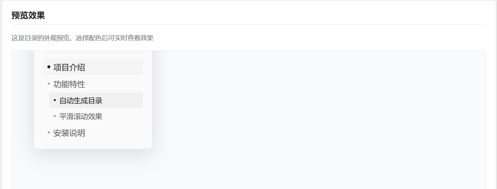

# Elegant TOC - 优雅的 WordPress 文章目录插件

一个现代、轻量、自适应的 WordPress 文章目录插件，自动生成美观的目录，支持平滑滚动、智能高亮和丰富的个性化配置。


## 页面预览


## ✨ 功能特性

### 核心功能
- **自动生成目录** - 根据文章中的 H2-H6 标题自动生成层级目录
- **平滑滚动** - 点击目录项平滑滚动到对应章节
- **智能高亮** - 根据阅读位置自动高亮当前章节
- **状态记忆** - 记住目录折叠/展开状态
- **单篇禁用** - 支持在特定文章/页面中禁用目录
- **短代码支持** - 使用 `[elegant_toc]` 在任意位置插入目录

### 自适应布局
- **桌面端**（浏览器宽度 ≥ 1024px 且正文左侧空间足够）：目录以左侧悬浮侧边栏形式显示，紧贴正文左侧，离开正文区域后自动隐藏
- **移动端 / 空间不足**：左下角显示目录触发按钮，点击后以底部浮层面板展开，带有缩放打开/关闭动画

### 个性化与主题
- **7 种色彩主题**：浅灰（默认）、清新蓝、自然绿、优雅紫、活力橙、暗夜黑、跟随系统
- **深色模式**：支持系统深色模式自动切换，同时兼容 `body.dark-mode`、`body[data-theme="dark"]`、`html.dark` 等常见主题类名
- **字号同步**：目录标题和条目字号自动与文章正文字号保持一致

## 📦 安装方法

1. 将整个插件文件夹上传到 `/wp-content/plugins/elegant-toc/` 目录
2. 在 WordPress 后台「插件」页面激活「Elegant TOC」
3. 点击插件列表中的「设置」或前往「设置」→「Elegant TOC」进行配置

## ⚙️ 配置选项

在「设置」→「Elegant TOC」中可配置：

- **启用目录** - 控制是否在文章中自动显示目录
- **显示位置** - 选择在哪些内容类型中显示目录（文章、页面、自定义类型等）
- **最少标题数** - 设置显示目录所需的最少标题数量（默认 3 个）
- **标题层级** - 选择参与生成目录的标题级别（H2-H6）
- **色彩主题** - 选择目录的整体配色方案

## 🖥️ 使用方式

### 自动显示
插件激活并启用后，会自动在满足条件的文章/页面中显示目录。

> 注意：站点首页（含静态首页）默认不插入目录，即使内容中包含短代码；目录仅在文章/页面等单篇内容中生成。

### 短代码
在文章/页面内容中插入短代码，即可在指定位置渲染目录：

```
[elegant_toc]
```

### 单篇禁用

**方法 1**：在文章编辑器右侧的「Elegant TOC」元数据框中勾选「在此文章/页面中禁用目录」。

**方法 2**：通过自定义字段禁用：
- 字段名：`_elegant_toc_disabled`
- 字段值：`1`

> 兼容说明：旧版本使用的无前缀字段 `disable_toc`（值为 `1`）仍会被识别；在编辑器中保存一次后会自动迁移到新字段。

## 🔧 开发者

### 自定义生效文章类型

通过 `elegant_toc_post_types` 过滤器可自定义哪些文章类型自动显示目录：

```php
add_filter('elegant_toc_post_types', function ($post_types) {
    $post_types[] = 'custom_post_type';
    return $post_types;
});
```

### 自定义滚动偏移

插件会自动探测管理工具栏和吸顶头部来计算锚点滚动偏移；如果你的主题结构特殊，可通过 `elegant_toc_scroll_offset` 过滤器强制指定偏移量（px）：

```php
add_filter('elegant_toc_scroll_offset', function () {
    return 120; // 单位：px
});
```

### 前端调试日志

前端默认不输出控制台日志。需要排查问题时，在浏览器控制台执行 `window.elegantTocDebug = true` 后刷新即可开启。

## 🗂️ 文件结构

```
elegant-toc/
├── elegant-toc.php          # 主插件文件（核心逻辑）
├── uninstall.php            # 卸载清理脚本
├── composer.json            # Composer 配置
├── README.md                # 项目说明文档
├── readme.txt               # WordPress.org 标准说明
├── LICENSE                  # GPL v2 许可证
├── .gitignore               # Git 忽略规则
├── index.php                # 目录列举防护（assets/admin/languages 同）
├── assets/
│   ├── style.css            # 前端样式
│   ├── admin.css            # 后台设置页样式
│   └── script.js            # 前端脚本
├── admin/
│   └── settings-page.php    # 后台设置页面模板
└── languages/
    └── elegant-toc.pot      # 翻译模板
```

## 🛠️ 技术特性

- 纯原生 JavaScript，无前端依赖
- CSS 自定义属性（CSS Variables）实现主题切换
- 节流与防抖优化滚动/resize 性能
- 条件加载资源（仅在需要的文章页面加载）
- 无障碍支持：ARIA 属性、焦点样式、键盘可访问

## 🔄 更新日志

### 1.9.1
- 修复：目录列表滚动定位偏移 —— 列表未设 `position: relative` 时 `offsetTop` 相对面板计算（多出 header 高度），长目录触发自动滚动后回滚，高亮项会滚出可视区
- 修复：admin.css 版本号误用 style.css 的文件时间戳，后台样式缓存不刷新
- 修复：PHP 8 下 `the_content` 在主循环之外被调用时的空值告警
- 修复：文章修订版本不再写入「禁用目录」自定义字段
- 优化：移除强加给整站的 `html { scroll-behavior: smooth }`；目录平滑滚动尊重系统「减弱动态效果」设置
- 优化：滚动高亮仅切换新旧链接类名，不再每帧全量增删；侧边栏可见性更新改为先读后写，消除滚动帧强制重排
- 优化：折叠状态改为点击时直接写入 localStorage，移除 MutationObserver
- 优化：资源版本号按需计算，减少每个请求的文件系统 stat 调用
- 优化：小屏（<600px）降低毛玻璃 backdrop-filter 模糊半径，降低移动端渲染开销
- 优化：生产环境默认关闭控制台调试日志（`window.elegantTocDebug = true` 开启）
- 无障碍：移动端面板支持 Esc 关闭并归还焦点；触发按钮增加 `aria-controls`；目录链接 aria-label 使用可翻译模板
- 维护：「禁用目录」字段迁移为 `_elegant_toc_disabled`（兼容旧字段 `disable_toc`）；新增 `elegant_toc_scroll_offset` 过滤器；清理死代码（topbar 装饰节点、重复 font-size、未定义的 CSS 变量）；后台设置页模板增加 ABSPATH 防护；补齐插件头信息（Requires at least / Requires PHP / Domain Path）；新增 LICENSE、readme.txt 与各目录 index.php 防护
- 加固：标题 id 冲突替换改用 `preg_replace_callback`，避免内容中的 `$`、`\` 被当作反向引用解释；`$_POST` 读取统一接入 `wp_unslash`

### 1.9.0
- 修复：标题自带 HTML 锚点且重复时，目录链接与页面锚点不一致导致跳转错乱
- 新增：`uninstall.php`，删除插件时清理设置与文章自定义字段（支持多站点）
- 完善：后台设置页全部文案接入国际化，更新翻译模板至 1.9.0
- 清理：移除未被加载的历史遗留代码与已失效的压缩资源文件
- 修复：深色模式下目录面板与触发按钮背景对比度不足
- 修复：RSS 订阅源中短代码占位符泄漏到正文
- 新增：短代码 `[elegant_toc title="自定义标题"]` 可自定义目录标题
- 新增：移动端目录面板打开时，下滑滑出文章尾部后自动收起回按钮态
- 优化：滚动偏移量计算结果缓存，resize 时失效重算，减少布局抖动
- 优化：移动端面板宽度抽取为 CSS 变量，视口判断改用 clientWidth 与 @media 同口径
- 优化：合并重复的 resize 处理器为单一节流函数
- 优化：目录面板与触发按钮加强毛玻璃（backdrop-filter）效果，降低背景不透明度
- 优化：回到首标题的高亮提示改为跟随主题色，并增强提示动画的醒目度

### 1.8.0
- 新增功能：用户可选择在文章、页面或自定义类型中显示目录
- 性能优化：添加选项缓存机制，避免重复数据库查询
- 新增桌面端左侧悬浮侧边栏布局
- 新增移动端底部浮层面板与缩放动画
- 新增 7 种色彩主题与深色模式支持
- 新增后台设置页实时预览

## 📄 许可证

本插件使用 GPL v2 或更高版本许可证。

## 🔗 项目主页

https://github.com/Jacky088/Elegant-TOC

---

为 WordPress 博客带来更优雅的阅读体验 ✨
